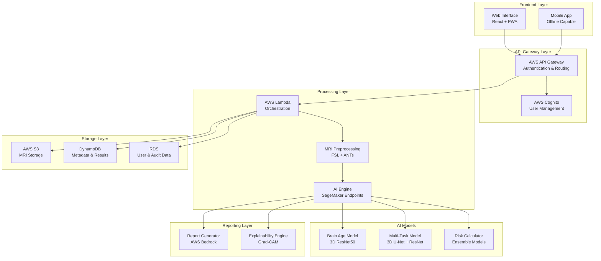
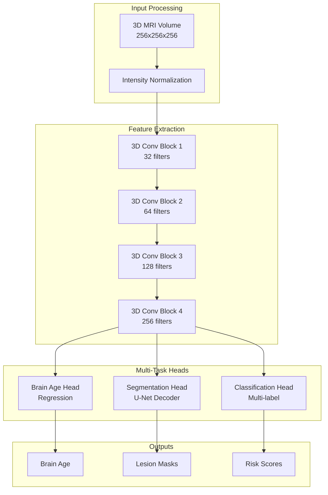

# Design Document: NeuroScan AI

## Overview

NeuroScan AI is a cloud-based artificial intelligence system that analyzes brain MRI scans to predict stroke and dementia risk years before symptoms appear. The system leverages state-of-the-art 3D convolutional neural networks with multi-task learning to provide seven critical neurological assessments: brain age estimation, white matter disease detection, silent stroke identification, brain atrophy analysis, microbleed detection, stroke risk prediction, and dementia risk assessment.

The architecture is designed for deployment in resource-constrained healthcare environments, particularly India's 25,000 Primary Health Centers, where general physicians lack access to specialized neurologists. The system processes MRI scans in under 2 minutes at a cost of ₹200 per screening, making advanced neurological assessment accessible to underserved populations.

## Architecture

### High-Level System Architecture



### Cloud Infrastructure Design

The system utilizes AWS services for scalability, reliability, and cost-effectiveness:

- **Compute**: AWS Lambda for serverless orchestration, SageMaker for AI model hosting
- **Storage**: S3 for MRI scan storage, DynamoDB for fast metadata access, RDS for structured data
- **Security**: Cognito for authentication, KMS for encryption, VPC for network isolation
- **Monitoring**: CloudWatch for logging and metrics, X-Ray for distributed tracing

## Components and Interfaces

### 1. Web Interface Component

**Technology Stack**: React 18 with TypeScript, Progressive Web App (PWA) capabilities

**Key Features**:
- Drag-and-drop MRI upload with progress tracking
- Offline report viewing using service workers
- Responsive design optimized for tablets and mobile devices
- Multi-language support (Hindi, English, regional languages)
- WhatsApp integration for report sharing

**Interface Specifications**:
```typescript
interface MRIUploadRequest {
  file: File;
  patientId: string;
  studyDate: Date;
  scannerType?: string;
}

interface AnalysisResult {
  scanId: string;
  brainAge: BrainAgeResult;
  whiteMatterDisease: WhiteMatterResult;
  silentStrokes: StrokeResult;
  brainAtrophy: AtrophyResult;
  microbleeds: MicrobleedResult;
  strokeRisk: RiskAssessment;
  dementiaRisk: RiskAssessment;
  explainabilityMaps: ExplainabilityResult;
}
```

### 2. MRI Preprocessing Pipeline

**Technology Stack**: FSL (FMRIB Software Library) and ANTs (Advanced Normalization Tools)

**Processing Steps**:
1. **DICOM Parsing**: Extract imaging data and metadata from DICOM files
2. **Quality Assessment**: Automated quality control using image metrics
3. **Skull Stripping**: Remove non-brain tissue using BET (Brain Extraction Tool)
4. **Bias Field Correction**: Correct for intensity inhomogeneities using N4ITK
5. **Registration**: Align to MNI152 standard space using ANTs
6. **Normalization**: Intensity normalization for consistent model input

**Performance Requirements**:
- Processing time: <30 seconds per scan
- Memory usage: <8GB RAM per concurrent scan
- Support for T1-weighted, T2-weighted, and FLAIR sequences

### 3. AI Engine Architecture

**Core Model Architecture**: Multi-task 3D Convolutional Neural Network



**Model Specifications**:
- **Backbone**: 3D ResNet50 with skip connections
- **Input Size**: 256×256×256 voxels, normalized to [0,1]
- **Training Data**: 13,000+ scans from OASIS, ADNI, IXI datasets
- **Loss Function**: Combined MSE (brain age) + Dice (segmentation) + BCE (classification)
- **Optimization**: AdamW optimizer with cosine annealing schedule

### 4. Risk Calculation Engine

**Stroke Risk Model**: Ensemble of gradient boosting and neural network models

**Input Features**:
- Imaging biomarkers (lesion volumes, brain age gap, microbleed count)
- Demographic factors (age, sex)
- Clinical risk factors (when available)

**Risk Calculation Formula**:
```
5-year Stroke Risk = sigmoid(
    α₁ × brain_age_gap + 
    α₂ × white_matter_volume + 
    α₃ × microbleed_count + 
    α₄ × silent_stroke_presence + 
    α₅ × age + 
    α₆ × sex
)
```

**Calibration**: Models calibrated on Indian population data using Platt scaling

### 5. Explainability Engine

**Technology**: Gradient-weighted Class Activation Mapping (Grad-CAM) for 3D volumes

**Visualization Components**:
- **Saliency Maps**: Highlight brain regions contributing to predictions
- **Overlay Visualizations**: Superimpose attention maps on original MRI
- **Region-based Explanations**: Quantify contribution by anatomical region
- **Comparative Analysis**: Show normal vs. abnormal patterns

## Data Models

### Core Data Structures

```typescript
// Patient Information
interface Patient {
  patientId: string;
  age: number;
  sex: 'M' | 'F';
  createdAt: Date;
  lastUpdated: Date;
}

// MRI Scan Metadata
interface MRIScan {
  scanId: string;
  patientId: string;
  uploadedAt: Date;
  scannerManufacturer: string;
  scannerModel: string;
  fieldStrength: number; // Tesla
  sequenceType: 'T1' | 'T2' | 'FLAIR' | 'DWI';
  voxelSize: [number, number, number];
  matrixSize: [number, number, number];
  processingStatus: 'uploaded' | 'preprocessing' | 'analyzing' | 'complete' | 'failed';
}

// Brain Age Assessment
interface BrainAgeResult {
  predictedAge: number;
  chronologicalAge: number;
  brainAgeGap: number;
  confidenceInterval: [number, number];
  percentileRank: number;
  riskLevel: 'low' | 'moderate' | 'high';
}

// White Matter Disease
interface WhiteMatterResult {
  totalLesionVolume: number; // mm³
  lesionCount: number;
  severityScore: number; // 0-100
  affectedRegions: Array<{
    region: string;
    volume: number;
    severity: 'mild' | 'moderate' | 'severe';
  }>;
  fazekaScale: number; // 0-3
}

// Silent Stroke Detection
interface StrokeResult {
  silentInfarcts: Array<{
    location: [number, number, number];
    volume: number;
    age: 'acute' | 'chronic';
    vascularTerritory: string;
  }>;
  lacunarStrokes: Array<{
    location: [number, number, number];
    diameter: number;
  }>;
  totalInfarctVolume: number;
}

// Brain Atrophy Analysis
interface AtrophyResult {
  hippocampusVolume: {
    left: number;
    right: number;
    percentile: number;
  };
  corticalThickness: {
    mean: number;
    percentile: number;
    regionalMeasures: Map<string, number>;
  };
  totalBrainVolume: number;
  ventricularVolume: number;
  atrophyScore: number; // 0-100
}

// Microbleed Detection
interface MicrobleedResult {
  microbleeds: Array<{
    location: [number, number, number];
    confidence: number;
    region: string;
  }>;
  totalCount: number;
  lobarCount: number;
  deepCount: number;
  infratentorialCount: number;
  riskCategory: 'low' | 'moderate' | 'high';
}

// Risk Assessment
interface RiskAssessment {
  fiveYearRisk: number; // percentage
  tenYearRisk: number; // percentage
  riskFactors: Array<{
    factor: string;
    contribution: number;
    modifiable: boolean;
  }>;
  recommendations: string[];
  urgencyLevel: 'routine' | 'urgent' | 'immediate';
}

// Explainability Data
interface ExplainabilityResult {
  gradCamMaps: {
    brainAge: string; // Base64 encoded image
    whiteMatter: string;
    strokes: string;
    atrophy: string;
    microbleeds: string;
  };
  regionContributions: Array<{
    region: string;
    contribution: number;
    explanation: string;
  }>;
  confidenceScores: Map<string, number>;
}
```

### Database Schema

**DynamoDB Tables**:
- **Scans**: Partition key: scanId, sort key: timestamp
- **Results**: Partition key: scanId, sort key: analysisType
- **Patients**: Partition key: patientId

**RDS Tables**:
- **Users**: Healthcare provider accounts and permissions
- **AuditLog**: Complete audit trail of all system actions
- **ModelVersions**: Track AI model versions and performance metrics

## Error Handling

### Error Classification and Response Strategy

**1. Input Validation Errors**
- **Invalid File Format**: Return HTTP 400 with specific format requirements
- **Corrupted DICOM**: Attempt repair, fallback to manual review queue
- **Insufficient Image Quality**: Provide quality improvement recommendations

**2. Processing Errors**
- **Preprocessing Failures**: Retry with alternative parameters, escalate if persistent
- **Model Inference Errors**: Fallback to ensemble voting, flag for manual review
- **Memory/Timeout Issues**: Implement progressive downsampling and chunked processing

**3. Infrastructure Errors**
- **AWS Service Outages**: Implement circuit breakers and graceful degradation
- **Database Connectivity**: Use connection pooling and automatic retry with exponential backoff
- **Storage Failures**: Implement multi-region replication and automatic failover

**Error Response Format**:
```typescript
interface ErrorResponse {
  errorCode: string;
  message: string;
  details?: any;
  retryable: boolean;
  suggestedActions: string[];
  supportContactInfo: string;
}
```

### Monitoring and Alerting

- **Real-time Monitoring**: CloudWatch dashboards for system health
- **Performance Metrics**: Processing time, accuracy metrics, cost per scan
- **Alert Thresholds**: >5% error rate, >3 minute processing time, >₹250 cost per scan
- **Escalation Procedures**: Automated PagerDuty integration for critical issues

## Testing Strategy

### Dual Testing Approach

The testing strategy combines comprehensive unit testing for specific scenarios with property-based testing for universal correctness validation. This dual approach ensures both concrete bug detection and general system reliability.

**Unit Testing Focus**:
- Specific examples demonstrating correct behavior
- Edge cases and error conditions (corrupted files, extreme values)
- Integration points between components
- API contract validation

**Property-Based Testing Focus**:
- Universal properties that must hold across all valid inputs
- Comprehensive input coverage through randomization
- Invariant preservation across transformations
- Round-trip consistency validation

### Property-Based Testing Configuration

**Testing Framework**: Hypothesis (Python) for property-based testing
**Configuration**: Minimum 100 iterations per property test
**Test Tagging**: Each property test references its design document property using format:
`# Feature: neuroscan-ai, Property {number}: {property_text}`

### Testing Infrastructure

**Test Data Management**:
- Synthetic MRI generation for comprehensive testing
- Anonymized clinical datasets for validation
- Automated test data refresh and versioning

**Continuous Integration**:
- Automated testing on every code commit
- Performance regression testing
- Model accuracy validation against benchmarks
- Security vulnerability scanning

**Load Testing**:
- Simulate 1000 concurrent scan uploads
- Validate auto-scaling behavior under load
- Cost optimization testing under various usage patterns

## Correctness Properties

*A property is a characteristic or behavior that should hold true across all valid executions of a system—essentially, a formal statement about what the system should do. Properties serve as the bridge between human-readable specifications and machine-verifiable correctness guarantees.*

Based on the prework analysis, I identified several areas where properties can be consolidated to eliminate redundancy while maintaining comprehensive coverage. The following properties represent the essential correctness guarantees for NeuroScan AI:

### Property Reflection

After analyzing all acceptance criteria, several redundant properties were identified and consolidated:

- **Processing Time Properties**: Combined individual timing requirements into comprehensive processing time guarantees
- **Report Generation Properties**: Consolidated multiple report content requirements into unified report completeness properties  
- **Explainability Properties**: Merged visualization requirements into comprehensive explainability generation properties
- **Risk Calculation Properties**: Combined individual risk assessment requirements into unified risk computation properties
- **Data Handling Properties**: Consolidated security and privacy requirements into comprehensive data protection properties

### Core Correctness Properties

**Property 1: Processing Time Guarantees**
*For any* valid brain MRI scan, preprocessing shall complete within 30 seconds and full analysis (including all 7 predictions) shall complete within 2 minutes total processing time
**Validates: Requirements 1.1, 1.2, 1.5**

**Property 2: Input Validation and Error Handling**
*For any* invalid or corrupted MRI file, the system shall reject the input and return a descriptive error message without processing
**Validates: Requirements 1.3**

**Property 3: Multi-Format Support**
*For any* valid MRI scan in DICOM, NIfTI, or other supported medical imaging formats, the system shall successfully process and analyze the scan
**Validates: Requirements 1.4**

**Property 4: Comprehensive Analysis Generation**
*For any* successfully processed brain MRI scan, the AI engine shall generate all 7 required predictions: brain age, white matter disease assessment, silent stroke detection, brain atrophy analysis, microbleed detection, stroke risk calculation, and dementia risk assessment
**Validates: Requirements 2.1, 3.1, 4.1, 5.1, 6.1, 7.1, 8.1**

**Property 5: Threshold-Based Risk Flagging**
*For any* analysis result where brain age exceeds chronological age by more than 5 years, brain volumes fall below age-adjusted ranges, or stroke risk exceeds 20%, the system shall appropriately flag these conditions and generate corresponding recommendations
**Validates: Requirements 2.2, 5.2, 7.4**

**Property 6: Explainability Generation Completeness**
*For any* completed analysis, the explainability engine shall generate visual heatmaps, anatomical localizations, and region-based explanations for all detected abnormalities and risk assessments
**Validates: Requirements 2.4, 3.4, 4.4, 5.4, 6.4, 8.4, 10.3**

**Property 7: Comprehensive Report Generation**
*For any* completed analysis, the report generator shall create both technical and patient-friendly reports containing all findings, explanations in appropriate language complexity, percentile rankings, and actionable recommendations
**Validates: Requirements 2.5, 3.5, 4.5, 5.5, 6.5, 8.5, 10.1, 10.2, 10.5**

**Property 8: Risk Calculation Completeness**
*For any* analysis with detected biomarkers, the risk calculator shall compute both 5-year and 10-year risk estimates incorporating age, sex, and all relevant imaging findings using population-calibrated models
**Validates: Requirements 4.2, 7.2, 7.3, 8.2**

**Property 9: Multi-Language and Sharing Support**
*For any* generated report, the system shall support generation in Hindi, English, and major regional Indian languages, and provide sharing capabilities via WhatsApp, email, and PDF download
**Validates: Requirements 9.5, 10.4**

**Property 10: Offline Functionality**
*For any* previously generated report, the web interface shall support offline viewing and basic functionality when internet connectivity is poor or unavailable
**Validates: Requirements 9.2**

**Property 11: Responsive Interface Behavior**
*For any* user interaction with the web interface, the system shall provide appropriate feedback including progress indicators during uploads, real-time status updates, and responsive design across tablets and mobile devices
**Validates: Requirements 9.3, 9.4**

**Property 12: Concurrent Processing Scalability**
*For any* system load up to 1000 concurrent MRI scans, the cloud platform shall maintain processing performance and automatically scale resources to preserve 2-minute processing times
**Validates: Requirements 11.1, 11.2**

**Property 13: Cost Control**
*For any* processed scan, the total processing cost including all AWS services shall remain under ₹200, with cost optimization measures triggered when budget thresholds are exceeded
**Validates: Requirements 11.4, 11.5**

**Property 14: Data Security and Privacy**
*For any* patient data uploaded to the system, all data shall be encrypted in transit and at rest using AES-256, automatically de-identified, and subject to comprehensive audit logging for all access events
**Validates: Requirements 12.1, 12.2, 12.5**

**Property 15: Data Retention Compliance**
*For any* patient data stored in the system, automatic deletion shall occur when retention periods expire, maintaining compliance with data protection requirements
**Validates: Requirements 12.4**

**Property 16: Model Training and Validation Consistency**
*For any* model training or validation process, the system shall use datasets containing 13,000+ brain scans from specified sources and demonstrate consistent performance across different MRI scanner types and protocols
**Validates: Requirements 13.1, 13.2, 13.3**

**Property 17: System Integration Compatibility**
*For any* integration with external healthcare systems, the platform shall support HL7 FHIR standards, DICOM protocols for PACS connectivity, SSO authentication, EHR-compatible report formats, and REST APIs for third-party development
**Validates: Requirements 14.1, 14.2, 14.3, 14.4, 14.5**

**Property 18: Continuous Learning and Backward Compatibility**
*For any* model update or deployment, the system shall maintain backward compatibility with existing workflows while supporting continuous learning from new validated cases
**Validates: Requirements 13.4, 13.5**

### Edge Case Properties

**Property 19: Microbleed Regional Categorization**
*For any* detected microbleeds, the system shall accurately count and categorize them by brain region (lobar, deep, infratentorial) and mark precise locations on brain visualizations
**Validates: Requirements 6.2, 6.4**

**Property 20: Dementia Type Assessment**
*For any* brain scan analysis, the system shall assess risk for all specified dementia types (Alzheimer's disease, vascular dementia, and mixed dementia) and highlight contributing brain regions when elevated risk is detected
**Validates: Requirements 8.1, 8.4**